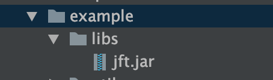

# NKscript

- [中文](README_ZH.md)
- English


Simplify the development mode of the Nk plugin, use scripted programming, and run directly without compilation

NKScript scripted programming solution

The purpose of NKScript is to simplify development and debug plugins better.

### For project structure and call files

NKScript is mainly divided into 5 modules

-info.ns
-main.ns
-listener
-command
-other

info.ns is similar to nukkit's plugin.yml, and its content is basically similar to plugin.yml.
The special element is the `id` element, which is designed to prevent conflicts between multiple plugins, and it will be used as the class root directory of the registration file.
When calling a script, the format is id. The name of the script file
For example id is `net.noyark`, then the script hello.ns is written
```groovy

class hello {
    /// ...
}

```
When called
```groovy
import net.noyark.hello
```
Of course, when writing the main class and listener, `package` and` class` can be omitted
Like main.ns
```groovy
@Override
void onLoad () {
    // ...
}
```
listener.ns
```groovy
@EventHandler
void onJoin (PlayerJoinEvent e) {

}

```
The main file of the script must be main.ns, when calling the main file, it is `import your id. Plugin name`
If the plugin name is `Hello` and the id is` net.noyark`
```groovy
// Import the main class
import net.noyark.Hello
```

In short, for file import, except the main class is id.pluginName, the others are id. Script file names,
Only listener and command, the main class can omit packageName and class, others must be
Class name
Package names can be omitted when writing other classes

For each class (except the main class), the default package name is id. Its folder

In the root directory, the script file must not have the same name as the plugin name

In addition, override the onCommand method with the parameter onCommand (CommandInfo info)
info.getCommand () Get command object
info.getLabel () Get instruction label
info.getArgs () Get command parameters
info.getSender () Get command sender

### info.nsWriting
```groovy
info{
      name "Hello" //插件名称,必须有
      version "1.0.0" //版本，可不写，不写默认为1.0.0
      author "MagicLu" //作者名 可不写
      listeners ["listener.ns"] //注册的监听器 如果没有可不写
      commandsMap ["command.ns"] //注册的指令 如果没有可不写
      id "net.noyark.www" //id号，意义如同前面所讲 
      description "" //介绍，可不写
      permissions ([
           "FirstPlugin.fp" : [
                  description : "",
                  default : "op"
           ]
      ]) //和nk插件的plugin.yml结构相同
      commands ([
          fp : [
              "usage" : "/fp help",
              "description" : "指令介绍",
              "permission" : "FirstPlugin.fp"
          ]
      ]) //和nk插件的plugin.yml结构相同
}
depends{ //依赖，如果没有可以忽略
    softDepend ([])
    depend ([])
    loadBefore([])
    scriptDepend([]) //前置脚本
}

```

Others are basically the same as NK. It uses groovy syntax and supports java writing. Registering listeners and instructions is also possible.
Use the original method.
The default command is to use SimpleCommand, see the example file for use.

### Native getInstance and injection assignment
The main file comes with a static getInstance method by default, which can directly get the current object
Like listener.ns, if my plugin name is HelloWorld and id is net.noyark.www
```groovy
import net.noyark.www.HelloWorld

import cn.nukkit.event.EventHandler
import cn.nukkit.event.player.PlayerJoinEvent

@EventHandler
void onPlayerJoin (PlayerJoinEvent e) {
    // getInstance () is the built-in method of HelloWorld
    PluginBase base = HelloWorld.getInstance ()

}

```
Automatic assignment
You can directly get the main class object through @MainPlugin. Of course, it can only be used in the main class, listener class, and command class.
E.g. listener.ns
```groovy
import net.noyark.www.HelloWorld

import cn.nukkit.event.EventHandler
import cn.nukkit.event.player.PlayerJoinEvent

@MainPlugin
PluginBase base

@EventHandler
void onPlayerJoin (PlayerJoinEvent e) {
    base.logger.info ("hello, world") // Can be called directly here
}
```

### Third-party library import
Just add the jar package in the root directory of your script folder / libs, and it will be read and loaded.


### What to do if Groovy script is inefficient?
You can discard dynamic typing because Groovy is still strongly typed. It can use @CompileStatic annotation to make your code compile statically, but you need to discard dynamic typing, similar to this
```groovy
@Command (name = "hello", description = "233", usageMessage = "/ hello")
@Arguments (max = 10, min = 0)
@CompileStatic
boolean onHelloCommand (CommandSender sender, String label, String [] args) {
    // Write instruction processing code here
    base.logger.info ("hello, world")
    return true
}
```

### info.retain property
Info.retain is set to true, you can compile the main class without shell.

info.ns
```groovy
info{
      name "Game"
      version "1.0.0"
      author "MagicLu"
      listeners (["PlayerListener.ns"])
      retain true
      id "net.noyark.www"
      description ""
      permissions ([
           "FirstPlugin.fp" : [
                  description : "",
                  default : "op"
           ]
      ])
      commands ([
          fp : [
              "usage" : "/fp help",
              "description" : "指令介绍",
              "permission" : "FirstPlugin.fp"
          ]
      ])
}
```

main.ns can only be written as
```groovy

class Game extends PluginBase{
    void onLoad(){
        this.logger.info("MagicLu's script example02,the simple pvp game")
    }

    void onEnable(){
        this.logger.info("插件已经加载")
    }

    void onDisable(){

    }
}
```

Significance of designing this: Some people may turn on ide's completion feature in order to use it
### Use a well-written script
Just put the folder under`plugins/NKScript`
