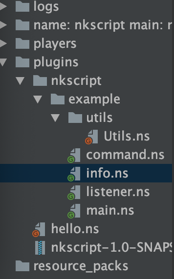

# NKscript 

- 中文
- [English](README.md)


简化Nk插件的开发模式，使用脚本化编程，无需编译直接运行

NKScript 脚本化编程方案

NKScript的目的是以简化开发为主，并且更好的调试插件。

### 对于项目结构和调用文件

NKScript主要分为5个模块

- info.ns
- main.ns
- listener
- command
- other

info.ns类似于nukkit的plugin.yml,其内容和plugin.yml也基本类似。
其中特殊的元素为`id`元素，是为了防止多个插件冲突而设计的，它会作为注册文件的类根目录。
在调用脚本时，格式就是id.脚本文件名称
例如id为`net.noyark`,则脚本hello.ns写作
```groovy

class hello{
    ///...
}

```
调用的时候
```groovy
import net.noyark.hello
```
当然在写主类和监听器的时候，`package`和`class`可以省略
如main.ns
```groovy
@Override
void onLoad(){
    //...
}
```
listener.ns
```groovy
@EventHandler
void onJoin(PlayerJoinEvent e){
    
}

```
脚本的主文件必须为main.ns,调用主文件的时候，则是`import 你的id.插件名`
如插件名为`Hello`,id为`net.noyark`
```groovy
//导入主类
import net.noyark.Hello
```

总之，对于文件导入，除了主类是id.pluginName,其他都是id.脚本文件名,
只有listener和command，主类可以省略packageName和class,其他必须要
有类名
写其他类时，可以省略包名

每个类(除了主类)，默认的包名为id.其所在的文件夹

在根目录上，脚本文件不得出现和插件名称重名的现象

另外，重写onCommand方法，参数为onCommand(CommandInfo info)
info.getCommand() 获得指令对象
info.getLabel() 获得指令label
info.getArgs() 获得指令参数
info.getSender() 获得指令发送者

### info.ns书写
```groovy
info{
      name "Hello" //插件名称,必须有
      version "1.0.0" //版本，可不写，不写默认为1.0.0
      author "MagicLu" //作者名 可不写
      listeners ["listener.ns"] //注册的监听器 如果没有可不写
      commandsMap ["command.ns"] //注册的指令 如果没有可不写
      id "net.noyark.www" //id号，意义如同前面所讲 
      description "" //介绍，可不写
      permissions ([
           "FirstPlugin.fp" : [
                  description : "",
                  default : "op"
           ]
      ]) //和nk插件的plugin.yml结构相同
      commands ([
          fp : [
              "usage" : "/fp help",
              "description" : "指令介绍",
              "permission" : "FirstPlugin.fp"
          ]
      ]) //和nk插件的plugin.yml结构相同
}
depends{ //依赖，如果没有可以忽略
    softDepend ([])
    depend ([])
    loadBefore([])
    scriptDepend([]) //前置脚本
}

```

其他基本和NK相同，采用groovy语法，并且支持java的写法，注册监听器和指令同样可以
使用原来的方法。
默认的指令则是使用了SimpleCommand,使用可以参见example文件

### 原生getInstance和注入赋值
主文件默认带一个静态的getInstance方法，可以直接获得当前的对象
如listener.ns,如果我的插件名称是HelloWorld,id是net.noyark.www
```groovy
import net.noyark.www.HelloWorld

import cn.nukkit.event.EventHandler
import cn.nukkit.event.player.PlayerJoinEvent

@EventHandler
void onPlayerJoin(PlayerJoinEvent e){
    //getInstance()是HelloWorld的自带方法
    PluginBase base = HelloWorld.getInstance()
    
}

```
自动化赋值
您可以通过@MainPlugin直接获得主类对象，当然只能使用于主类，监听器类，命令类
如listener.ns
```groovy
import net.noyark.www.HelloWorld

import cn.nukkit.event.EventHandler
import cn.nukkit.event.player.PlayerJoinEvent

@MainPlugin
PluginBase base

@EventHandler
void onPlayerJoin(PlayerJoinEvent e){
    base.logger.info("hello,world") //这里可以直接调用
    
}
```

### 第三方库导入
只需要在你的脚本文件夹根目录/libs下添加jar包，即可被读取加载


### Groovy脚本效率很低怎么办？
您可以抛弃动态类型，因为Groovy依然是强类型的，它可以使用@CompileStatic注解使得您的代码静态编译，但是需要您抛弃动态类型,类似于这样
```groovy
@Command(name = "hello",description = "233",usageMessage = "/hello")
@Arguments(max = 10,min = 0)
@CompileStatic
boolean onHelloCommand(CommandSender sender, String label, String[] args){
    //这里写指令处理代码
    base.logger.info("hello,world")
    return true
}
```

### info.retain属性
info.retain设置为true，可以对主类不进行套壳编译。

info.ns
```groovy
info{
      name "Game"
      version "1.0.0"
      author "MagicLu"
      listeners (["PlayerListener.ns"])
      retain true
      id "net.noyark.www"
      description ""
      permissions ([
           "FirstPlugin.fp" : [
                  description : "",
                  default : "op"
           ]
      ])
      commands ([
          fp : [
              "usage" : "/fp help",
              "description" : "指令介绍",
              "permission" : "FirstPlugin.fp"
          ]
      ])
}
```

main.ns只能写成
```groovy

class Game extends PluginBase{
    void onLoad(){
        this.logger.info("MagicLu's script example02,the simple pvp game")
    }

    void onEnable(){
        this.logger.info("插件已经加载")
    }

    void onDisable(){

    }
}
```

设计这个的意义: 有些人可能为了使用ide的补全功能，可以开启它
### 使用编写好的脚本
直接将文件夹放到`plugins/NKScript`下即可

